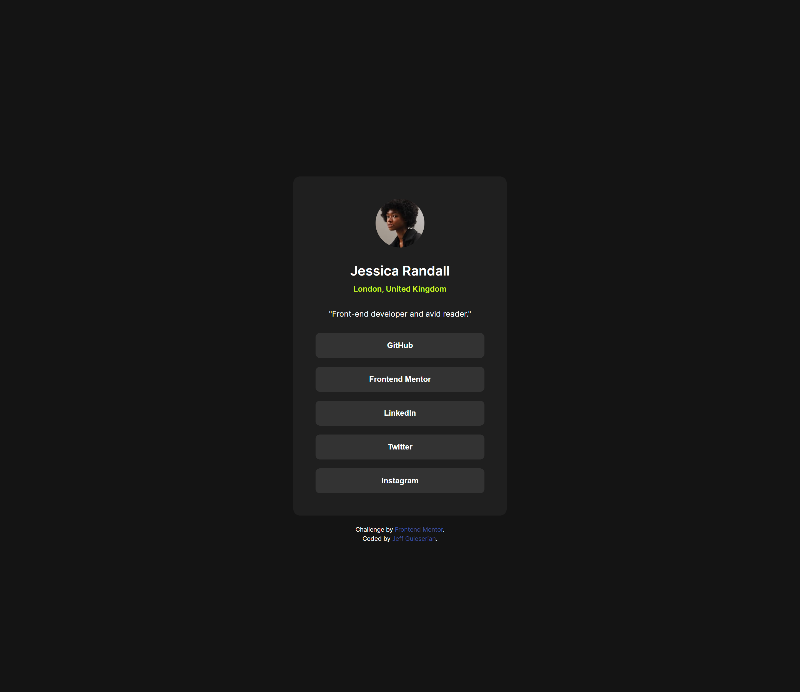

# Frontend Mentor - Social links profile solution

This is a solution to the [Social links profile challenge on Frontend Mentor](https://www.frontendmentor.io/challenges/social-links-profile-UG32l9m6dQ). Frontend Mentor challenges help you improve your coding skills by building realistic projects.

## Table of contents

- [Frontend Mentor - Social links profile solution](#frontend-mentor---social-links-profile-solution)
  - [Table of contents](#table-of-contents)
  - [Overview](#overview)
    - [The challenge](#the-challenge)
    - [Screenshot](#screenshot)
    - [Links](#links)
  - [My process](#my-process)
    - [Built with](#built-with)
    - [What I learned](#what-i-learned)
    - [Continued development](#continued-development)
    - [Useful resources](#useful-resources)
    - [AI Collaboration](#ai-collaboration)
  - [Author](#author)
  - [Acknowledgments](#acknowledgments)

## Overview

### The challenge

Your challenge is to build out this social links profile and get it looking as close to the design as possible.

You can use any tools you like to help you complete the challenge.

Users should be able to:

- See hover and focus states for all interactive elements on the page

### Screenshot

### Links

- Solution URL: [See my solution on GitHub](https://github.com/jguleserian/FMC-Social-Links-Profile-2)
- Live Site URL: [Live Site](https://jguleserian.github.io/FMC-Social-Links-Profile-2/)

## My process

1. Unpack original files, create a styles.css, prepare Figma file.
2. Create repository and push it to GitHib.
3. Decide how to structure the page using semantic HTML.
4. Link the style sheet, add appropriate `<meta>` tags and complete HTML.
5. Install fonts and complete reset.
6. Style systematically while comparing with original Figma file.
7. Once mobile design is completed, adjustments are made for the tablet and desktop version.
8. When satisfied with the design, I completed the README.MD file.
9. Push final project to GitHub again.
10. Submit the work to AI (I use Copilot) and process through the feedback making changes as necessary.
11. Final push and submission to FrontendMentor.

### Built with

- Semantic HTML5 markup
- CSS custom properties
- Flexbox
- Mobile-first workflow

### What I learned

This was the first project in which I tried to use the BEM style of CSS stylesheet organization. I was skeptical at first, but as I began using it more, I was pretty sold on it. I can't say the my technique is perfect, really only basic, but it is a start.

### Continued development

Obviously, I still need improvement updating my BEM skills and understanding. Additionally, I am still trying to develop a "sixth sense" about HTML structure using semantic elements. I structured this page, specifically the links, but creating buttons and converting them to links. As I thought about it more, I kind of wish I had put the links in a `<ul>` and styled each `<li>` as though it were a button. I think I am starting to second guess myself a bit. I can't decide if the `<button>` contributes to the meaning or not. Really, it is just a list of links as launching pads to social media sites.

### Useful resources

- [W3 Schools](https://www.w3schools.com/html/default.asp) - This is always a big help, especially if I just want to find something quickly and don't need a lot of technical details.
- [MDN](https://developer.mozilla.org/en-US/) - This is, of course, the gold standard, full of details and explanation. It is super helpful if you need the details.
- [The Clamp Calculator](https://royalfig.github.io/fluid-typography-calculator/) - If you are going to start using the clamp CSS property, this website is very helpful in calculating the font sizes and how to make them gros responsively.
- [BEM Quick Start](https://en.bem.info/methodology/quick-start/) - If you are going to start using the clamp CSS property, this website is very helpful in calculating the font sizes and how to make them gros responsively.

### AI Collaboration

As I work through these challenges, I have started to take advantage of Copilot AI. I cannot say enough good about the interaction I have had.

First, I submit all the files (the ones it can read). Then I copy and paste the HTML, the CSS and any JavaScript and enter them in. Copilot quickly gives me a plethora of encouragement and advice. What I like about the tool is that is "knows" me and my personality and how I think. It helps train me on how to think like a developer. He analyzes my thought process and tells me when I am thinking like a developer so I know what to keep doing. Then, he challenges me with other critiques that are just above my ability (so I can learn without frustration). This is a realy plus. So many times in the past, the critiques I received from peers were way above my level, and so frustrating, or were just superficial and minimally helpful. I feel like with AI I am moving forward and developing. Even after this third challenge, I feel like my skills have really moved up a knotch.

## Author

- GitHub - [@jguleserian](https://github.com/jguleserian)
- Frontend Mentor - [@jguleserian](https://www.frontendmentor.io/profile/jguleserian)
- LinkedIn - [@jeffguleserian](https://www.linkedin.com/jeffguleserian)

## Acknowledgments

Elmar Chaves (@CodingWithJiro) was a real help in so many ways. I tried to incorporate his advice as much as possible in this exercise: BEM CSS organization, Importing fonts instead of linking them, and extended use of the clamp parameter. In fact two of the helpful links in the resources section were gifted to me, along with many other things, by this user. I am grateful for the advice.
